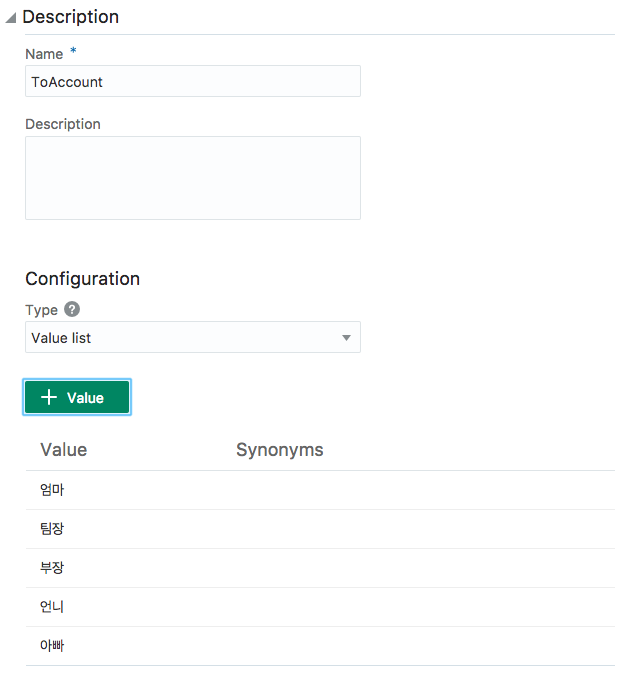
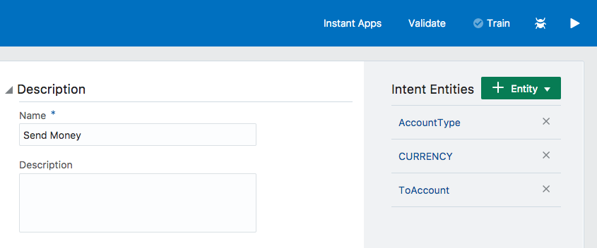

Lab200 - Training Data를 사용해 Chatbot을 Train
=======

이 랩에서는 간단한 금융 봇을 정의하고 테스트하여 작동 원리를 배울 것입니다. LAB100에서 본 챗봇을 어떻게 교육 시키는지 어떻게 비지니스 플로우를 정의 하는지를 알아 볼 것입니다. 아래의 네가지 항목은 이번 랩에서 배울 것입니다.
1.  Intent
2.  Entity
3.  Utterances
4.  Flow

이 랩을 하기전에 필요한 항목을 확인하세요. labfiles\code에서 아래의 파일들이 있는지 확인해주세요.
-   FirstBotYAML.txt

**Step 1: 간단한 Banking bot 만들기**
=======

### 1. FirstBot\_본인의이니셜 ex)FirstBot\_shjeon으로 봇을 만들어 주세요.

### 2. 각 각의 컴포넌트를 눌러보면서 어떤기능이 있는지 살펴보세요. 

**Step 2: 챗봇에서 intent, entity, flow 만들기**
=======

이 섹션에서는 utterances를 추가함으써, intent를 생성 할 것입니다. 후에,
각각의 intent에 필요한 entity를 추가하고, 비지니스 로직을 flow에서 정의
할 것입니다. 이렇게 만들어진 챗봇을 테스트 해 보겠습니다.

### 1.  초록색 버튼으로 intent를 추가해 주세요.

그림과 같이 Balances라는 intent를 알 수 있게 example utterances를 넣음으로써 봇을 교육 시켜 주세요.
 

아래의 utterances 들도 넣어주세요. 
 - 잔액 얼마
 - 제가 작년에 얼마 저금 했죠?
 - 통장 잔액
 - 계좌 잔고를 보여줘
 - 현재 저의 잔고를 알려주세요
 - 제 통장의 잔액은 얼마가 있나요?
 - 계좌에 얼마 있죠?
 - 잔고가 얼마인가요?
 - 통장에 얼마 있죠?
 
 
모두 넣으면 아래의 그림과 같이 보여질 것 입니다.

Send Money라는 두번째 intent를 만들어주세요. 후에, 아래의 utterances를 추가 해 주세요.
-   Lauren에게 사진값 25달러 보내
-   아빠 계좌에 10달러 보내
-   매달 엄마에게 500달러 보내줘
-   아빠에게 200달러 계좌이체 해주세요
-   매달 1일에 Cleo한테 월세를 내
-   점심값 20달러 보내줘
-   20달러를 송금해줘

### 2.  intent에 entity를 추가 해 주세요. 계좌의 잔고를 조회하기 위해서는 사용자가 원하는 잔고가 "어떤" 계좌의 잔고인지 알아합니다. 이 경우 "어떤" 계좌는 entity입니다. entity를 생성해서 intent에 연결 해 주세요

아래 보이는 것 처럼, Send Money 또한 entity를 만든 후에 intent에 추가 해 주세요. 

### 3. labfiles 폴더 안에 있는 FirstBotYAML.txt을 열어서 Flow에 넣어주세요.

### 4.  현재까지 example utterances를 이용해 2개의 intent를 만들었으며, 필요한 entity를 추가했습니다. 그리고 이 intent와 entity를 사용해 대화가 어떻게 흘러갈지 flow를 정의했습니다. Train 버튼을 눌러서 Bot을 교육 시켜 주세요. 재생 버튼을 눌러서 봇을 Test 해 보겠습니다. intent 감지와 entity 추출이 정상동작하는지 확인합니다. 또한, 탭을 옮겨서 그럼 flow도 확인 해 주세요.

