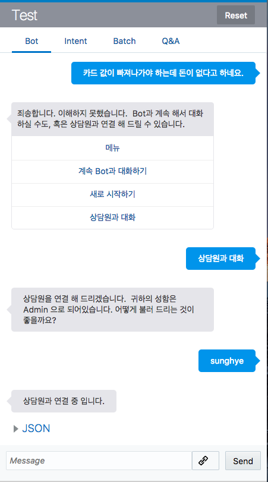
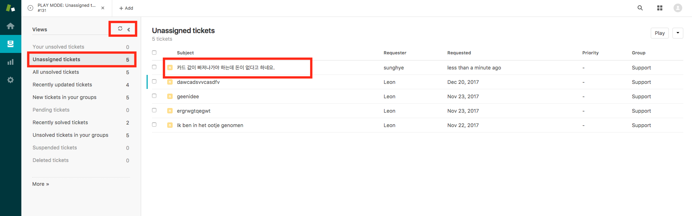
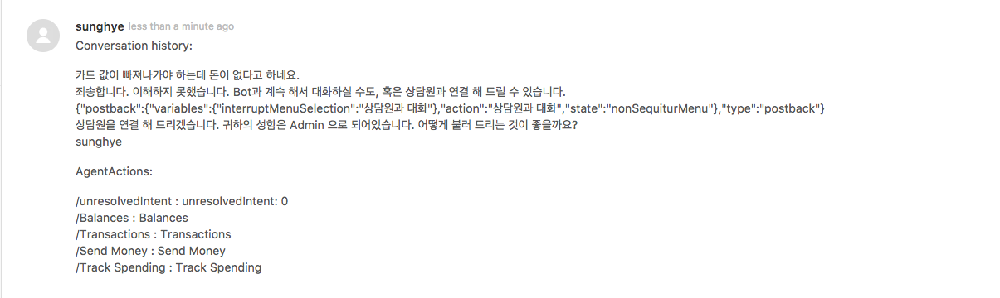
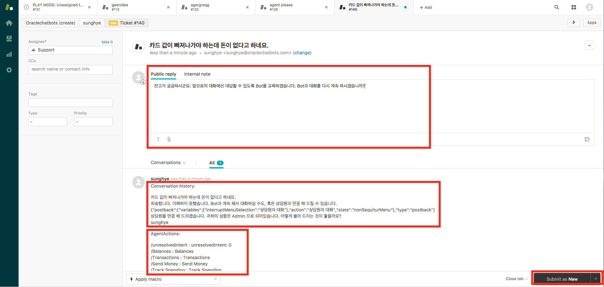
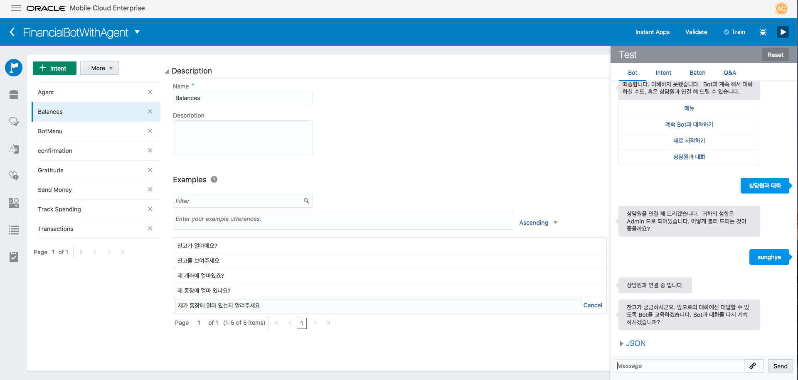
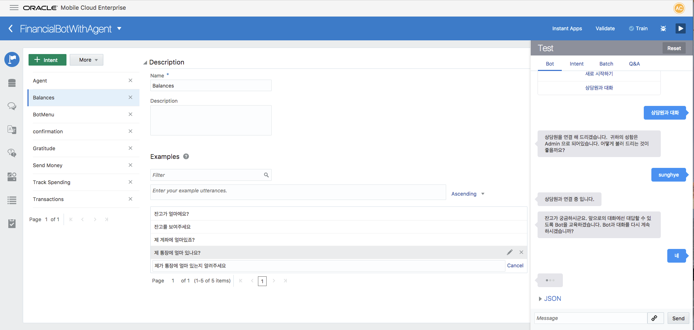
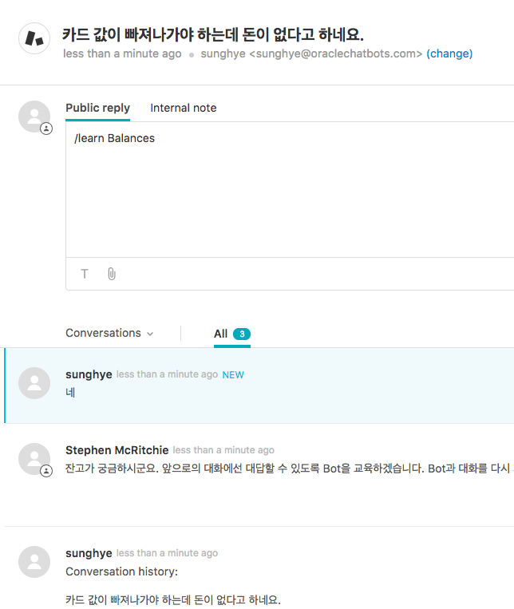
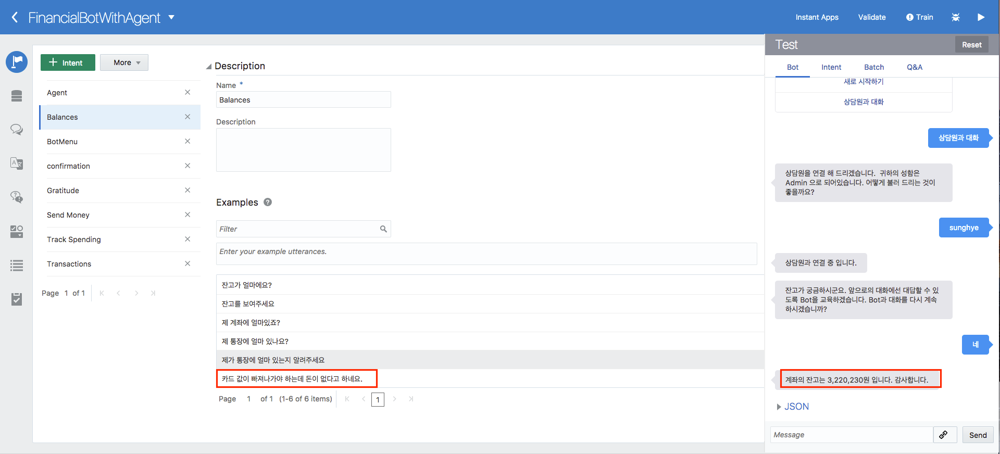

Lab600 - Zendesk를 이용한 상담원 시스템 연결
=======
이번 랩에서는 Zendesk라는 상담원 시스템을 Channel Connector를 간단히 이용해서 연결,  Train까지 할 수 있는 것 알아 보겠습니다. Lab 500과 마찮가지로, 가장 최근의 버전이 필요합니다. 또한 Zendesk의 seperate subscription이 필요하니, 이점 유의해 주시길 바랍니다. (https://www.zendesk.kr/product/pricing)

**Step 1. Zendesk Channel 등록하기**
=======

    Channel Tab에 들어가서, 아래와 같은 Zendesk Type의 Channel이 등록되어 있는 것을 확인 해 주세요.

**Step 2. Zendesk를 Flow에서 부르기**
=======

**Step 3. Zendesk와 integration을 테스트하고 인식하지 못한 문장 Bot Train 하기**
=======

### 1. Train되어 있지 않은 문장으로 Test합니다. 
모른다고 대답하는 대신 상담원을 연결 하는 옵션을 제공합니다. 받아온 username을 쓰거나 input을 받을 수 있습니다.

### 2. Zendesk 쪽에서 Sign-in을 해주세요.

### 3. Zendesk에서 로그인 하면 oracle domain으로 들어 올 수 있습니다.
예상하는 대화가 보이지 않을땐 새로고침을 눌러주세요. 새로고침 후에는 Bot이 이해하지 못한 메세지가 나오는 것을 볼 수 있습니다.

### 4. 클릭을 해서 들어가면, 이때까지 Bot과 사용자 간의 대화 기록과, Bot의
Intent list, intent list에 대한 결과를 볼 수 있습니다. 여기서 상담원은 대화를 진행 할수도, Bot을 트래이닝 시킬수도, 트래이닝 시키지 않고 intent로 바로 연결 할 수도 있습니다.

\

### 5. Agent가 답장을 하기 전 화면과 Zendesk에서의 화면을 볼 수 있습니다.

### 6. 상담원을 통해서 새로운 문장이 Train이 된것을 확인 할 수 있으며, Flow에
다시 돌아가서 Bot이 대화를 컨트롤 하는 것을 볼 수 있습니다.

